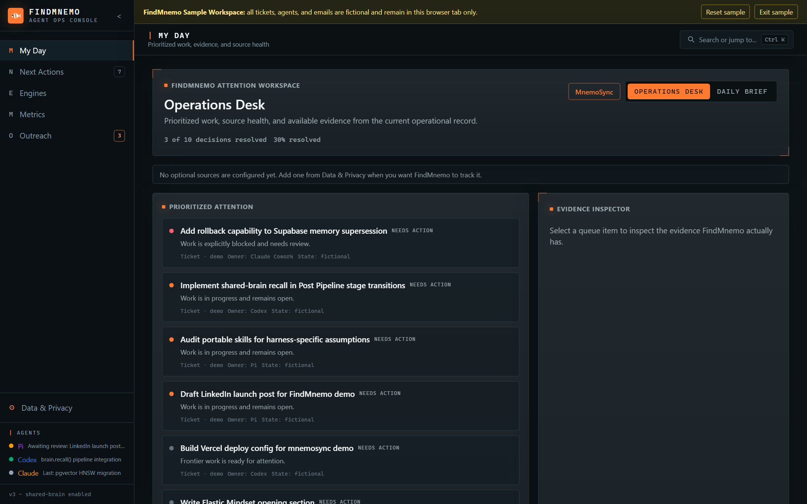

# FindMnemo

A local-first operations console for working with AI agents: tickets, agent activity, Gmail follow-ups, and model routing in one workspace — with the data kept on your machine.

[**Live sample workspace**](https://findmnemo.vercel.app/demo) · [Run from source](docs/source-run.md) · [Docs](docs/)

The operational route at `/app` requires the local Windows companion to be installed and running; the hosted interface cannot install or start it. The previous `mnemosync.vercel.app` address remains a compatibility fallback.

[](https://github.com/flowersbl00minadarkr00m/findmnemo/actions/workflows/source-run.yml)
[](LICENSE)



## Features

- Prioritized ticket queue where every item links to the evidence FindMnemo actually observed
- Privacy-minimized activity reporting from Pi, Codex CLI, and Claude Code (lifecycle metadata only)
- Gmail follow-up triage using the metadata scope — message bodies never enter the system
- Chat-native model routing: dispatch work to Pi, Codex, Claude Code, Ollama, or OpenRouter and get results back in the originating chat
- Local model-usage metrics, refreshed manually, never uploaded
- A companion process that binds only to `127.0.0.1`, storing everything in local SQLite

## Quick start

```bash
npm ci
npm run build:source
npm run start:companion
```

Open `http://127.0.0.1:3210/app` — or try the hosted [sample workspace](https://findmnemo.vercel.app/demo) first (fictional data, browser-only). Full setup, including Gmail OAuth and diagnostics: [source-run guide](docs/source-run.md) · [Gmail setup](docs/gmail-setup.md) · [platform support](docs/platform-support.md).

## How it works

A React front end (hosted or local) pairs with a Node companion on your machine. The companion owns the SQLite database, the Gmail OAuth credential (stored in the OS credential vault), and all source connections; the browser receives only minimized, allowlisted data. The `/demo` route is a fictional sample workspace that never touches operational sources. See the [navigation guide](docs/navigation.md) and [source setup](docs/source-onboarding.md).

External Codex, Claude, and Pi sessions need a local bridge or browser automation before their tickets count as live agent-created work. The hosted interface alone cannot observe private desktop sessions.

## Privacy

- Operational data stays in the companion's local SQLite; nothing operational is hosted.
- Gmail is metadata-scope only — bodies and credentials are barred from logs, telemetry, and the browser.
- Agent activity excludes prompts, transcripts, paths, and file contents; only bounded lifecycle metadata is retained.

Details: [data portability](docs/data-privacy.md) · [agent activity boundary](docs/agent-activity.md)

## License

[MIT](LICENSE) · [Third-party notices](THIRD_PARTY_NOTICES.md)
