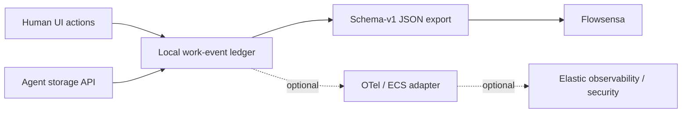

# FindMnemo telemetry architecture

FindMnemo is the activity producer and work-state surface.

The ledger is local and append-only. Consumers use an explicit versioned export
or adapter; they never read FindMnemo localStorage directly.

Elastic is optional infrastructure. If Elastic Security becomes the canonical
SIEM, security-relevant FindMnemo events require an ECS mapping and belong in a
separate data stream from the full work-event record.

## Frontend build standards

Large secondary views remain lazy-loaded so the primary Operations Desk route does not absorb their charting or feature code. Review treats new Vite/Rolldown bundle-size warnings as a Standards-axis finding and requires either a justified boundary or a narrower split.
